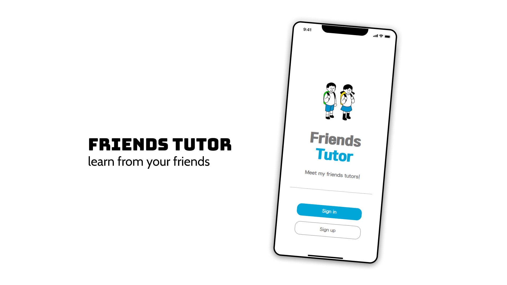
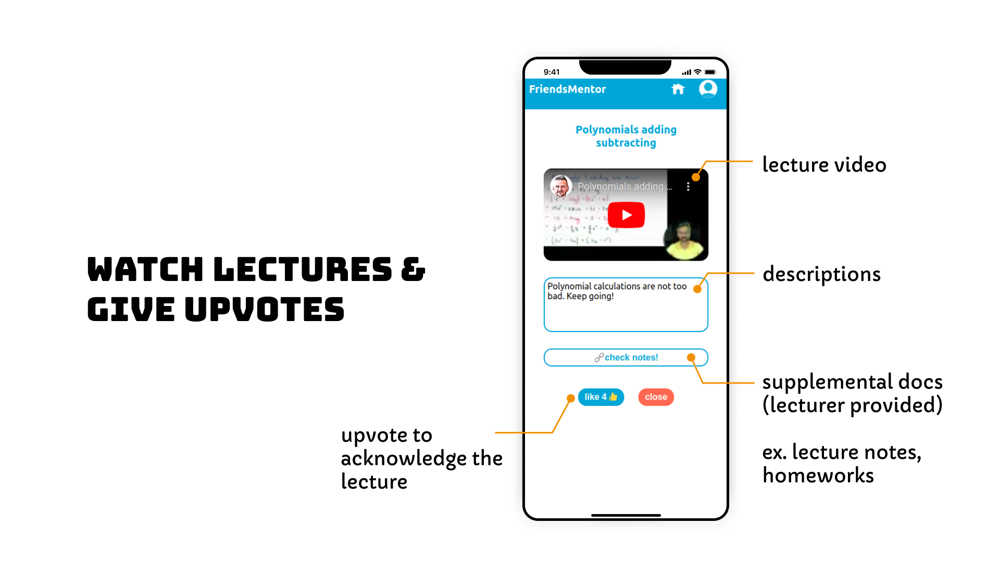

# 👫 [Friends Tutor](https://friends-tutor.netlify.app/)




> ## Learn from your friends. 

Friends Tutor is a lecture provider platform where lectures recorded by students are shared worldwide.

<center>
<a href="https://friends-tutor.netlify.app/"></a> <a href="https://www.youtube.com/watch?v=v39WYfTsenQ"></a>
</center>


  

  


# Table of Contents
[1. Backgrounds](#1)

&nbsp;&nbsp;&nbsp;&nbsp;[1.1) What is the problem?](#1-1)

&nbsp;&nbsp;&nbsp;&nbsp;[1.2) What is the solution?](#1-2)


[2. Introducing Friend Mentor](#2)

&nbsp;&nbsp;&nbsp;&nbsp;[2.1) Login and Signup](#2-1)

&nbsp;&nbsp;&nbsp;&nbsp;[2.2) Browse Lectures & Give upvotes](#2-2)
  
&nbsp;&nbsp;&nbsp;&nbsp;[2.3) Upload my lectures](#2-3)

&nbsp;&nbsp;&nbsp;&nbsp;[2.4) Certificates](#2-4)

[3. Setup & Requisites](#3)


[4. Project Architecture](#4)

&nbsp;&nbsp;&nbsp;&nbsp;[4.1) Project structure](#4-1)

&nbsp;&nbsp;&nbsp;&nbsp;[4.2) Techs Used](#4-2)

&nbsp;&nbsp;&nbsp;&nbsp;[4.3) Deployment](#4-3)


[5. Contributors](#5)


<a name="1"></a>
# ✨ 1. Backgrounds 

<a name="1-1"></a>
## 1.1) What is the problem?

Living in underdeveloped countries, especially in places without educational infrastructures like schools or libraries, it is very hard to learn a piece of knowledge by oneself. It is almost impossible to get access to quality education content. 

Not only in those countries, there still are places in South Korea where general education is not in reach. For instance, one of our beta test user Jiwoo lives in an island where there are insufficient internet connection. 

The problem doesn't end here. Even in places with those infrastructures, the education quality is not guaranteed. Some schools might lack in Science teachers, while others don't have appropriate learning materials. 


<a name="1-2"></a>
## 1.2) What is the solution?

Project 'Friends Tutor' is motivated by one of Albert Einstein's quotes.

> If you can't explain it simply, you don't understand it enough.

This quote implies that once a student learned something thouroughly, one can also explain it to others. Also, thinking backwards, if we evaluate whether students can explain well about a topic they learned, we can 'grade them' without exams.

 Our goal is to build a 'Stack overflow','Coursera', and 'Wikipedia' on school basic subjects. We dreamed an online website( or an app) where **kids can freely access peer's explaination on things they didn't understand in school.** 

Project 'Friends Tutor' tries to achieve the <u>4th goal of UN SDG sustainable Goals</u>, which is **Quality Education**. Specifically, this project aims to gain progress on **indicator 4.1.1. and 4.5.1.**

> 4.1.1<br/>
Proportion of children and young people (a) in grades 2/3; (b) at the end of primary; and (c) at the end of lower secondary achieving at least a minimum proficiency level in (i) reading and (ii) mathematics, by sex

> 4.5.1 <br/>Parity indices (female/male, rural/urban, bottom/top wealth quintile and others such as disability status, indigenous peoples and conflict-affected, as data become available) for all education indicators on this list that can be disaggregated


<a name="2"></a>
# 😎 2. Introducing Friend Mentor

<a name="2-1"></a>
## 2.1) Login & Sign up


<a name="2-2"></a>
## 2.2) Browse Lectures & Give upvotes



<a name="2-3"></a>
## 2.3) Upload my lectures


<a name="2-4"></a>
## 2.4) Certificates


<a name="3"></a>
# 3. Setup & Requisites

Minimum environment requirements versions are as follows.


> OS : (ubuntu) 18.04 LTS <br>Node.js : 16.19.1 (Gallium) <br>npm : 9.6.2

First. clone files from git.
```bash
git clone https://github.com/2ood/friends-tutor.git 
# web communicates through demo backend domain.
# (which is https://www.gdsc-gist-lms.page:443)
```
Currently, main branch is <u>connected to demo backend domain.</u> 
If you want to run in the same local machine of backend, you should clone branch **'localhost-branch'**.

```bash
git clone -b localhost-branch https://github.com/2ood/friends-tutor.git
# web communicates with http://localhost:8080.
```

Then, install dependencies and run.
```bash
cd friends-tutor/friends-tutor
npm install
npm start
```

<a name="4"></a>
# 🖥️ 4. Project Architecture

<a name="4-1"></a>
## 4.1) Project structure


The project is version-controlled by git. 

Following is the git repository for web-backend.

[https://github.com/kimtks456/friend-tutor-backend](https://github.com/kimtks456/friend-tutor-backend/tree/demo)


<a name="4-2"></a>
## 4.2) Techs Used


|**Frontend**|tech used|
|---|---|
|Design | Figma |
|web-dev | React |
|web-deploy | Netlify|


|**Backend**|tech used|
|---|---|
|backend-dev | Spring |
|backend-deploy | GCP|
|DBMS | MySQL |

|**Others**|tech used|
|---|---|
|version control | git, Github|
|API documentation | Swagger|
|Task organization | Notion |
|Video edit | Adobe Premiere Pro |

<a name="4-3"></a>
## 4.3) Deployment

Currrent Demo of project 'Friends Tutor' is being deployed upon Netlify.

[https://friends-tutor.netlify.app/](https://friends-tutor.netlify.app/)


<a name="5"></a>
# 👥 5. Contributors

## FE
* [Suyeon Shim](https://github.com/Shimsuyeon) : FE Design, FE Development (My page)
* [Seungbin Shin](https://github.com/binnie723) : FE Design, FE Development (Main page, Login, Logout)
* [Kyugnmin Choi](https://github.com/2ood) : FE Management, FE Development (Lecture Upload, browse, view)

## BE
* [San Kim](https://github.com/kimtks456) : PM, BE Development


