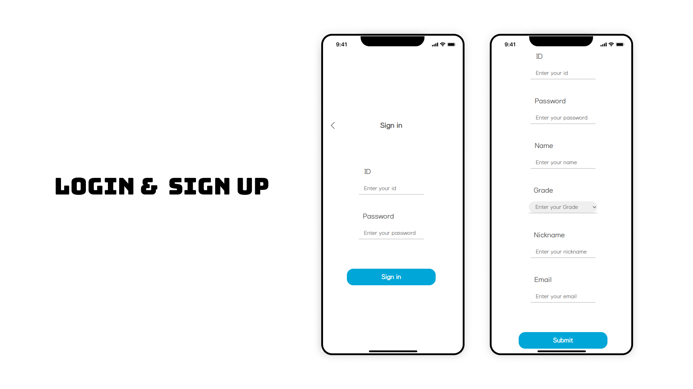
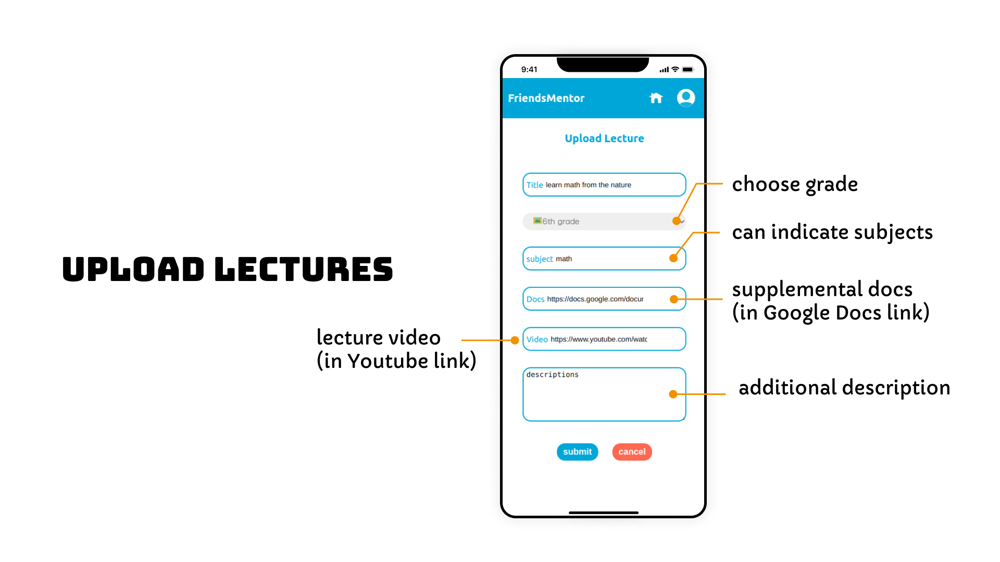
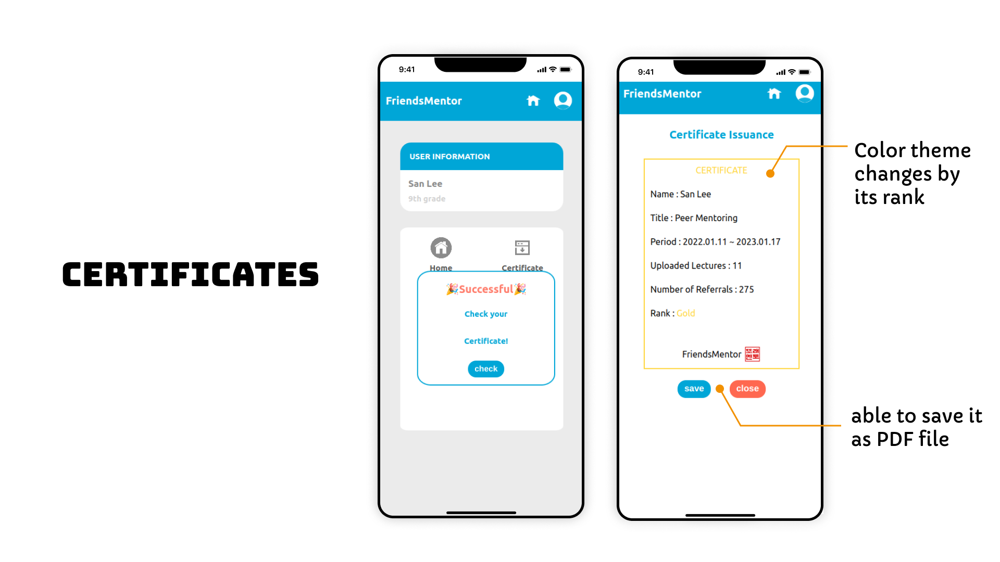
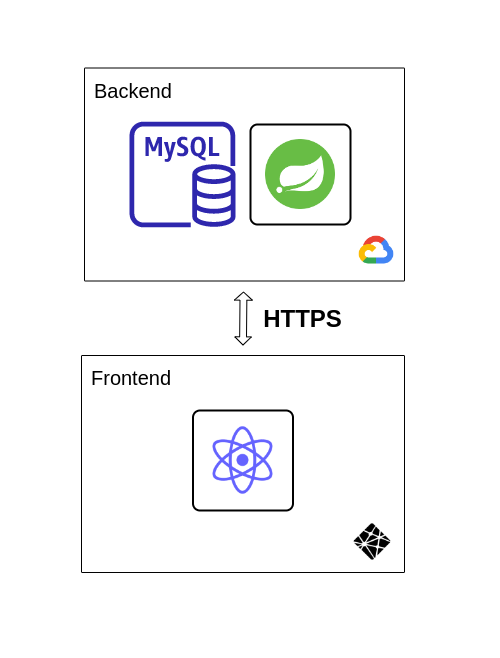

# Friend Mentor


> ## Learn from your friends. 

Friend mentor is a lecture provider platform where lectures recorded by students are shared worldwide.


  

  


# Table of Contents
[1. Backgrounds](#1)

&nbsp;&nbsp;&nbsp;&nbsp;[1.1) What is the problem?](#1-1)

&nbsp;&nbsp;&nbsp;&nbsp;[1.2) What is the solution?](#1-2)

&nbsp;&nbsp;&nbsp;&nbsp;[1.3) What software is needed?](#1-3)

[2. Introducing Friend Mentor](#2)

&nbsp;&nbsp;&nbsp;&nbsp;[2.1) Login and Signup](#2-1)

&nbsp;&nbsp;&nbsp;&nbsp;[2.2) Browse Lectures & Give upvotes](#2-2)
  

&nbsp;&nbsp;&nbsp;&nbsp;[2.3) Upload my lectures](#2-3)

&nbsp;&nbsp;&nbsp;&nbsp;[2.4) Certificates](#2-4)

[3. Setup](#3)


[4. Project Architecture](#4)

&nbsp;&nbsp;&nbsp;&nbsp;[4.1) Flowchart](#4-1)

&nbsp;&nbsp;&nbsp;&nbsp;[4.2) Techs Used](#4-2)


[5. Contributors](#5)

<a name="1"></a>
# 1. Backgrounds

<a name="1-1"></a>
## 1.1) What is the problem?

As a student, our team understands how hard it is to learn a piece of knowledge by oneself. It is very hard to 


<a name="1-2"></a>
## 1.2) What is the solution?

Project 'Friends Mentor' is motivated by one of Albert Einstein's quotes.

> If you can't explain it simply, you don't understand it enough.

This quote implies that once a student learned something thouroughly, one can also explain it to others. Also, thinking backwards, if we evaluate whether students can explain well about a topic they learned, we can 'grade them' without exams.

 Our goal is to build a 'Stack overflow','Coursera', and 'Wikipedia' on school basic subjects. We dreamed an online website( or an app) where kids can freely access peer's explaination on things they didn't understand on school 

Project 'Friends Mentor' tries to achieve the <u>4th goal of UN SDG sustainable Goals</u>, which is **Quality Education**. Specifically, this project aims to gain progress on **indicator 4.1.1. and 4.c.1.**

> 4.1.1
Proportion of children and young people (a) in grades 2/3; (b) at the end of primary; and (c) at the end of lower secondary achieving at least a minimum proficiency level in (i) reading and (ii) mathematics, by sex

> 4.c.1
Proportion of teachers with the minimum required qualifications, by education level


<a name="1-3"></a>
## 1.3) What software is needed?

<a name="2"></a>
# 2. Introducing Friend Mentor

<a name="2-1"></a>
## 2.1) Login & Sign up




<a name="2-2"></a>
## 2.2) Browse Lectures & Give upvotes


<a name="2-3"></a>
## 2.3) Upload my lectures




<a name="2-4"></a>
## 2.4) Certificates




<a name="3"></a>
# 3. Setup

```bash
npm build 
```

<a name="4"></a>
# 4. Project Architecture

<a name="4-1"></a>
## 4.1) Project structure



<a name="4-2"></a>
## 4.2) Techs Used


<a name="5"></a>
# 5. Contributors


